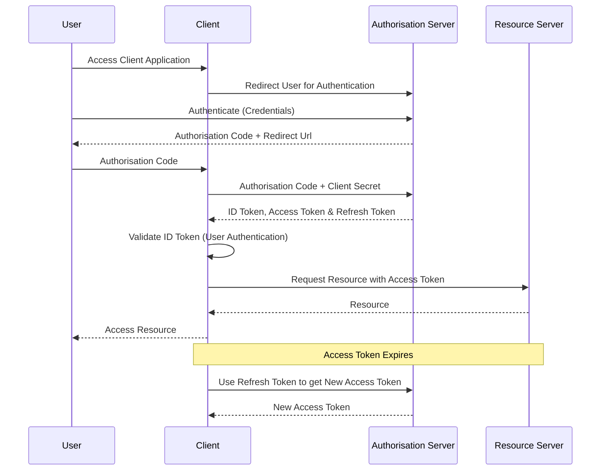

```mermaid
sequenceDiagram
    participant User as User
    participant Client as Client
    participant AuthServer as Authorisation Server
    participant ResourceServer as Resource Server

    User->>Client: Access Client Application
    Client->>AuthServer: Redirect User for Authentication
    User->>AuthServer: Authenticate (Credentials)
    AuthServer-->>User: Authorisation Code + Redirect Url
    User->>Client: Authorisation Code
    Client->>AuthServer: Authorisation Code + Client Secret
    AuthServer-->>Client: ID Token, Access Token & Refresh Token

    Client->>Client: Validate ID Token (User Authentication)
    Client->>ResourceServer: Request Resource with Access Token
    ResourceServer-->>Client: Resource 
    Client-->>User: Access Resource
    Note over Client,ResourceServer: Access Token Expires

    Client->>AuthServer: Use Refresh Token to get New Access Token
    AuthServer-->>Client: New Access Token

```    