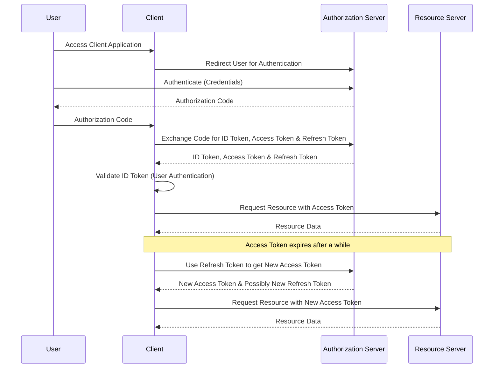

```mermaid
sequenceDiagram
    participant User as User
    participant Client as Client
    participant AuthServer as Authorization Server
    participant ResourceServer as Resource Server

    User->>Client: Access Client Application
    Client->>AuthServer: Redirect User for Authentication
    User->>AuthServer: Authenticate (Credentials)
    AuthServer-->>User: Authorization Code
    User->>Client: Authorization Code
    Client->>AuthServer: Exchange Code for ID Token, Access Token & Refresh Token
    AuthServer-->>Client: ID Token, Access Token & Refresh Token

    Client->>Client: Validate ID Token (User Authentication)
    Client->>ResourceServer: Request Resource with Access Token
    ResourceServer-->>Client: Resource Data

    Note over Client,ResourceServer: Access Token expires after a while

    Client->>AuthServer: Use Refresh Token to get New Access Token
    AuthServer-->>Client: New Access Token & Possibly New Refresh Token

    Client->>ResourceServer: Request Resource with New Access Token
    ResourceServer-->>Client: Resource Data
```    