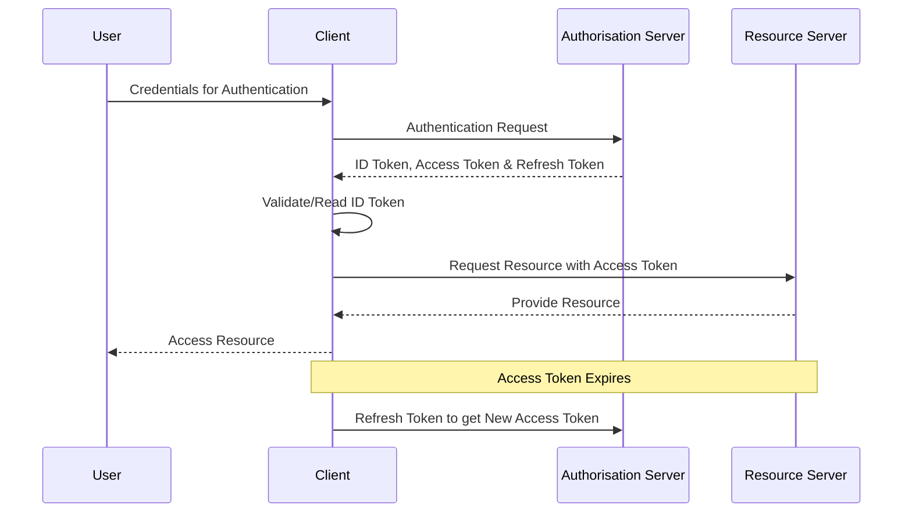

```mermaid
sequenceDiagram
    participant User as User
    participant Client as Client
    participant AuthServer as Authorisation Server
    participant ResourceServer as Resource Server

    User->>Client:Credentials for Authentication
    Client->>AuthServer: Authentication Request
    AuthServer-->>Client: ID Token, Access Token & Refresh Token

    Client->>Client: Validate/Read ID Token
    Client->>ResourceServer: Request Resource with Access Token
    ResourceServer-->>Client: Provide Resource
    Client-->>User: Access Resource
    Note over Client,ResourceServer: Access Token Expires

    Client->>AuthServer: Refresh Token to get New Access Token
```