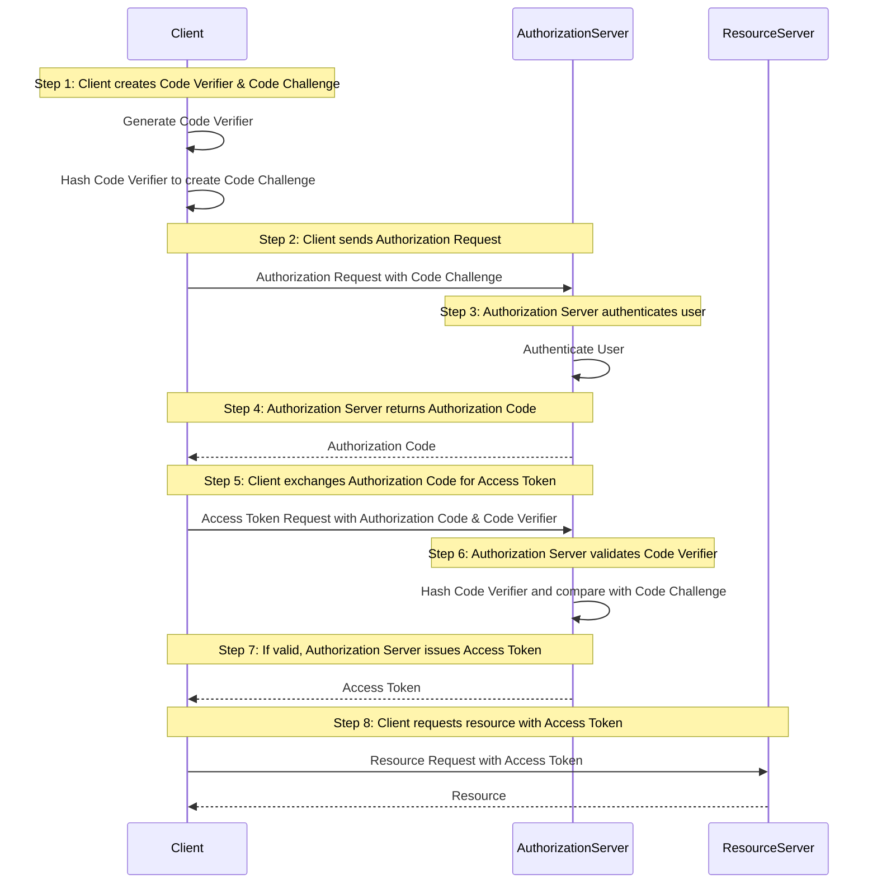

```mermaid
sequenceDiagram
    participant Client
    participant AuthorizationServer
    participant ResourceServer

    Note over Client: Step 1: Client creates Code Verifier & Code Challenge
    Client->>Client: Generate Code Verifier
    Client->>Client: Hash Code Verifier to create Code Challenge

    Note over Client,AuthorizationServer: Step 2: Client sends Authorization Request
    Client->>AuthorizationServer: Authorization Request with Code Challenge

    Note over AuthorizationServer: Step 3: Authorization Server authenticates user
    AuthorizationServer->>AuthorizationServer: Authenticate User

    Note over AuthorizationServer,Client: Step 4: Authorization Server returns Authorization Code
    AuthorizationServer-->>Client: Authorization Code

    Note over Client,AuthorizationServer: Step 5: Client exchanges Authorization Code for Access Token
    Client->>AuthorizationServer: Access Token Request with Authorization Code & Code Verifier

    Note over AuthorizationServer: Step 6: Authorization Server validates Code Verifier
    AuthorizationServer->>AuthorizationServer: Hash Code Verifier and compare with Code Challenge

    Note over AuthorizationServer,Client: Step 7: If valid, Authorization Server issues Access Token
    AuthorizationServer-->>Client: Access Token

    Note over Client,ResourceServer: Step 8: Client requests resource with Access Token
    Client->>ResourceServer: Resource Request with Access Token
    ResourceServer-->>Client: Resource
```