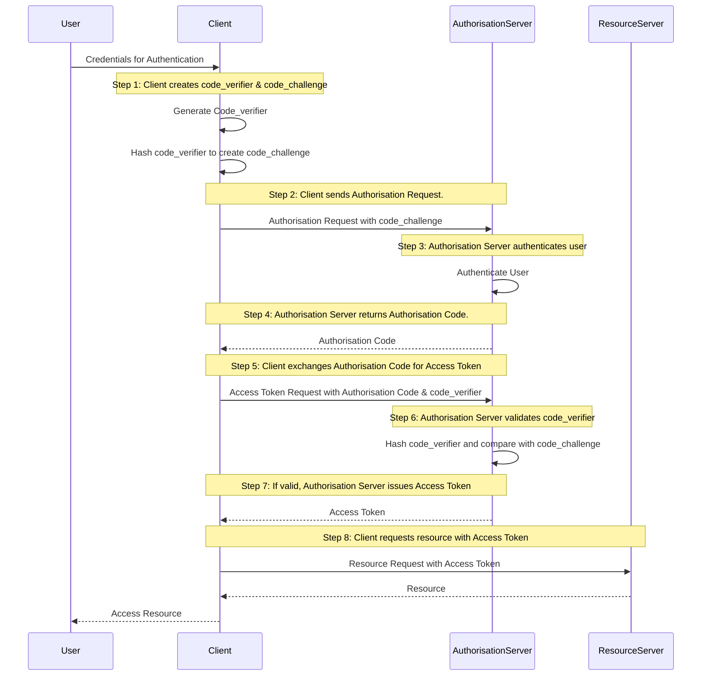

```mermaid
sequenceDiagram
    participant User as User
    participant Client
    participant AuthorisationServer
    participant ResourceServer

    User->>Client:Credentials for Authentication
    Note over Client: Step 1: Client creates code_verifier & code_challenge
    Client->>Client: Generate Code_verifier
    Client->>Client: Hash code_verifier to create code_challenge

    Note over Client,AuthorisationServer: Step 2: Client sends Authorisation Request.
    Client->>AuthorisationServer: Authorisation Request with code_challenge

    Note over AuthorisationServer: Step 3: Authorisation Server authenticates user
    AuthorisationServer->>AuthorisationServer: Authenticate User

    Note over AuthorisationServer,Client: Step 4: Authorisation Server returns Authorisation Code.
    AuthorisationServer-->>Client: Authorisation Code

    Note over Client,AuthorisationServer: Step 5: Client exchanges Authorisation Code for Access Token
    Client->>AuthorisationServer: Access Token Request with Authorisation Code & code_verifier

    Note over AuthorisationServer: Step 6: Authorisation Server validates code_verifier
    AuthorisationServer->>AuthorisationServer: Hash code_verifier and compare with code_challenge

    Note over AuthorisationServer,Client: Step 7: If valid, Authorisation Server issues Access Token
    AuthorisationServer-->>Client: Access Token

    Note over Client,ResourceServer: Step 8: Client requests resource with Access Token
    Client->>ResourceServer: Resource Request with Access Token
    ResourceServer-->>Client: Resource
    Client-->>User: Access Resource
```