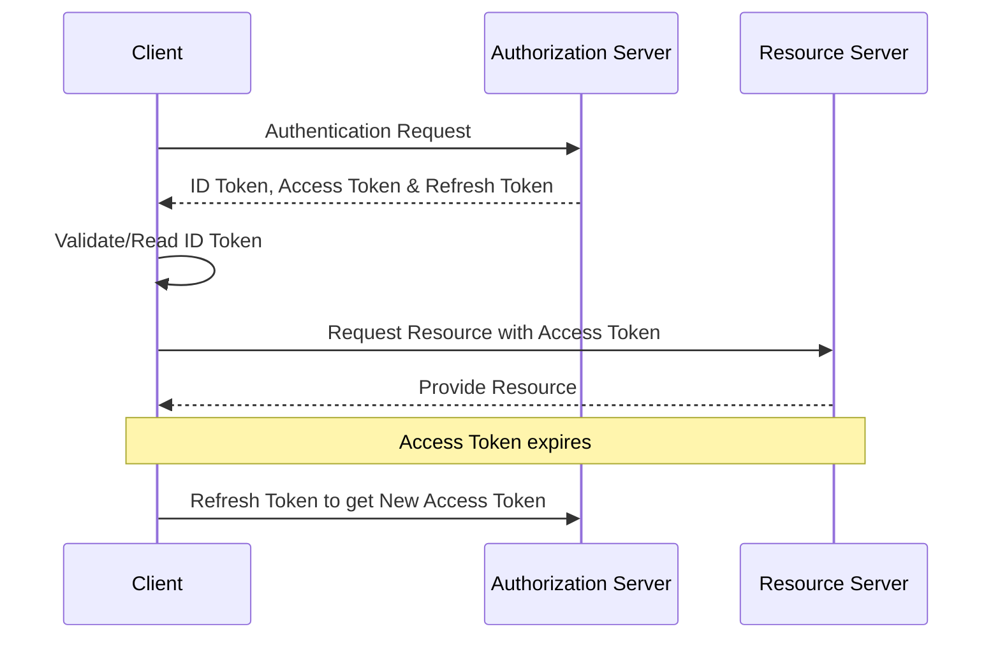

```mermaid
sequenceDiagram
    participant Client as Client
    participant AuthServer as Authorization Server
    participant ResourceServer as Resource Server

    Client->>AuthServer: Authentication Request
    AuthServer-->>Client: ID Token, Access Token & Refresh Token

    Client->>Client: Validate/Read ID Token
    Client->>ResourceServer: Request Resource with Access Token
    ResourceServer-->>Client: Provide Resource

    Note over Client,ResourceServer: Access Token expires

    Client->>AuthServer: Refresh Token to get New Access Token
```